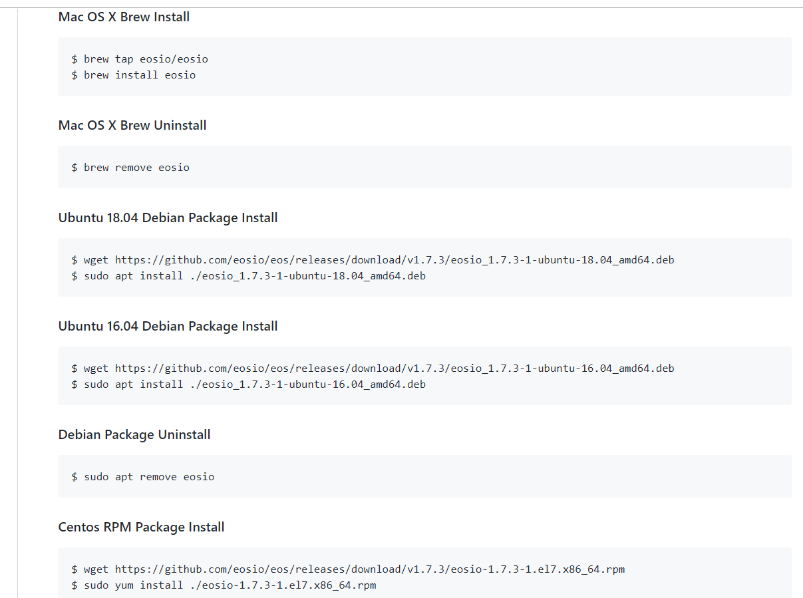
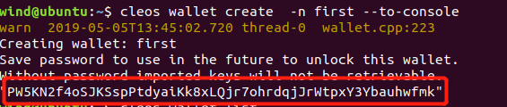
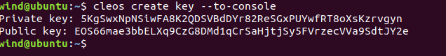
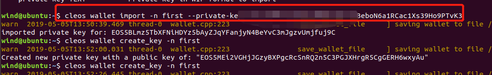
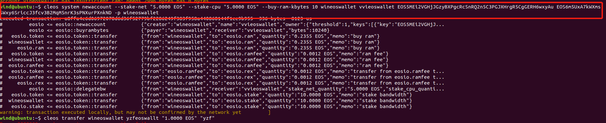
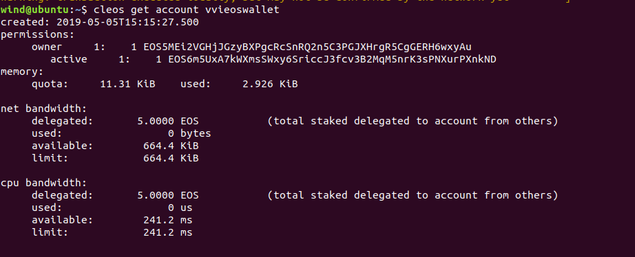

## EOS Comand Line

#### 1. 打开网站[https://github.com/EOSIO/eos](<https://github.com/EOSIO/eos>)，选择合适版本安装


#### 2. 去相应的网站去找对应的接入点


```shell
选任意一个接入点，然后
alias cleos="cleos -u https://jungle2.cryptolion.io:80"
source .bashrc
```

#### 2.创建钱包

````shell
cleos wallet create -n walletname --to-console
````


#### 并记下密码

#### 3. 查看钱包

````shell
cleos wallet list
````


#### 带 * 表示解锁了，如果没有解锁则 cleos wallet unlock -n walletname  然后填写上一步记下的钱包密码

#### 4.创建密钥对，两对 owner key 和active key

```
cleos create key --to-console
```




#### 并记下密钥对

#### 5. 把对应网站注册好并有EOS账号导入钱包 owner key 和 active key

````
cleos wallet import -n walletname --private-key ${privatekey} 
````




#### 6 查看账户信息

```
cleos get account accountname
```


#### 7 创建账号

````
cleos system newaccount --stake-net "5.0000 EOS" --stake-cpu "5.0000 EOS" --buy-ram-kbytes 10 ${createAccountName} ${newAccountName} ${ownerPublicKey} ${activePublicKey} -p ${createAccountName}
````

可以为第四步创建的任意的publickey 都可以为 ${ownerPublicKey} ${activePublicKey} 



等区块确认查看刚才创建账号是否成功



#### 8 转账

```
cleos transfer ${fromaccount} ${toaccount} "1.0000 EOS" "hello"
```

