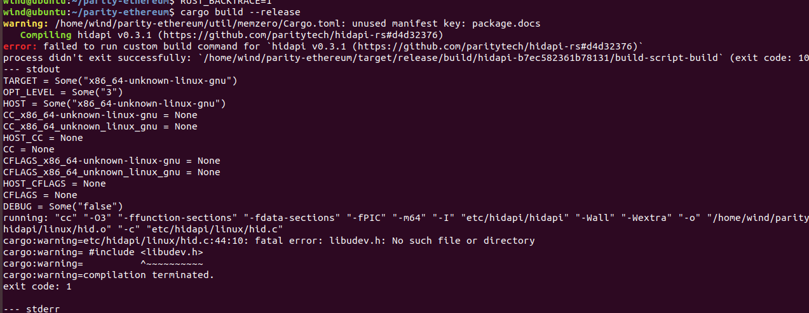
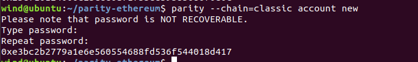
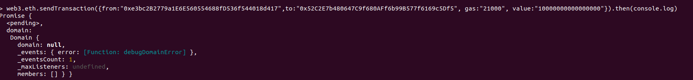
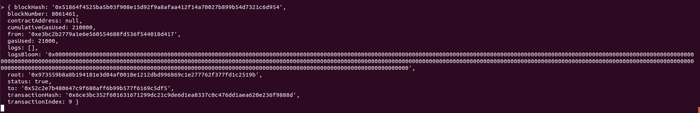
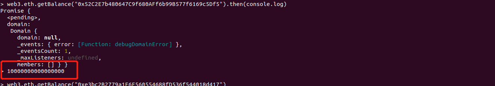

## parity-ethereum build

#### 1 安装依赖

```shell
 curl https://sh.rustup.rs -sSf | sh
```

#### 2 添加把cargo到环境变量中

````shell
export PATH=PATH:~/.cargo/bin
````

#### 3 检查是否安装了 Perl,没有安装去安装 <https://www.perl.org/>

```shell
perl -version
```

#### 4 检查是否安装了yasm

```shell
yasm --version
如果没安装
sudo apt install yasm
```

#### 5.clone 

````shell
git clone https://github.com/paritytech/parity-ethereum
````

#### 6.最近的版本同步区块有问题，切换到stable 
````shell
cd parity-ethereum
git checkout stable
````

#### 7.build

```shell
cargo build --release
```

如果出现错误



执行 

```shell
apt-get install libudev-dev
安装好后再build
cargo build --release
```

如果再出现错误


执行

```shell
sudo apt-get install -y cmake
cargo build --release
```

#### 8.创建账号

```
parity --chain=classic account new 
```

输入密码



keystore 文件在 ~/.local/share/io.parity.ethereum/keys/classic 里面

#### 9.转账(前提是要安装好了node 和 web3)

```
node
var Web3=require("web3")
var web3=new Web3(new Web3.providers.WebsocketProvider("ws://127.0.0.1:8546"))
转账：
web3.eth.sendTransaction({from:fromaddress,to:toaddress, gas:"21000", value:value}).then(console.log)
```

转账：



转账信息：



查询是否到账


到账！