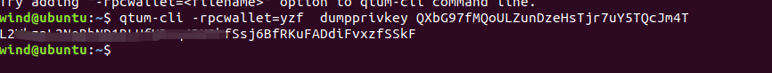
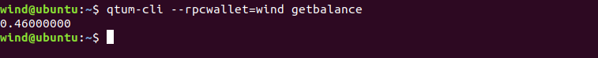

## QTUM

#### 1.安装各种依赖 <https://github.com/qtumproject/qtum>  及make

```
sudo apt-get install build-essential libtool autotools-dev automake pkg-config libssl-dev libevent-dev bsdmainutils git cmake libboost-all-dev
sudo apt-get install software-properties-common
sudo add-apt-repository ppa:bitcoin/bitcoin
sudo apt-get update
sudo apt-get install libdb4.8-dev libdb4.8++-dev


git clone https://github.com/qtumproject/qtum --recursive
cd qtum


./autogen.sh
./configure 
make -j2
```


#### 2.各项准备完成后 去 https://www.coinexchange.io/network/peers/QTUM 找addnode 

```
qtumd &
查看命令 qtum-cli help
qtum-cli  stop

cd ~/.qtum
vim qtum.conf
设置rpcuser 和 rpcpassword
rpcuser=user
prcpassworld=password
# 复制找到的addnode
addnode=165.22.128.16
addnode=149.129.73.169
addnode=35.195.44.64
addnode=47.104.171.92
addnode=13.113.4.105
addnode=165.227.41.125
addnode=167.99.175.139
addnode=219.241.140.106

保存后启动
qtumd
```


#### 3.创建钱包

```
qtum-cli createwallet walletname
```


#### 4.创建账号

```
qtum-cli --rpcwallet=walletname getnewaddress accountname
```


#### 5. 查看私钥

```
qtum-cli -rpcwallet=yzf  dumpprivkey QXbG97fMQoULZunDzeHsTjr7uY5TQcJm4T
```



#### 6.转账

```
qtum-cli -rpcwallet=walletname sendtoaddress toaddress
```


#### 7. 查看是否转账成功

```
qtum-cli --rpcwallet=walletname getbalance
```


转账成功！

