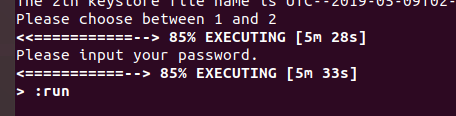
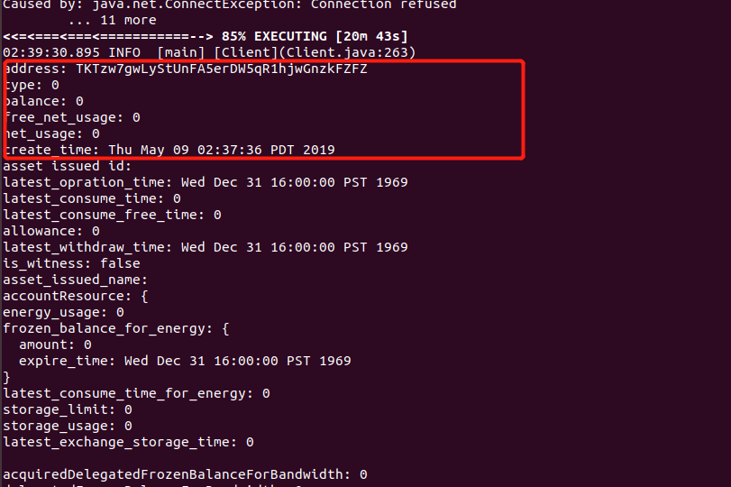

#### TRX Cli 搭建

#### 1. git clone <https://github.com/tronprotocol/wallet-cli.git>

#### 2. cd wallet-cli/src/main/resources

````
vim config.conf 
````

复制

```
net {
 type = mainnet
 #type = testnet 
}

fullnode = {
  ip.list = [
    "34.220.77.106:50051"
  ]
}

```

ip.list 可以去 <https://github.com/tronprotocol/Documentation/blob/master/TRX_CN/Official_Public_Node.md> 找

#### 3.  进入 wallet-cli 目录 build

```
./gradlew build 
```

如果没有安装java会报错，安装java 再 gradlew build ，有java不用安装

```shell
sudo apt-get install openjdk-8-jdk
```

#### 4.  

```shell
gradlew run
```

#### 5. 

````
RegisterWallet
````

输入两次密码，密码必须包含大小写和数字，于是生成了钱包


#### 6.导出钱包私钥，自己放在秘密的地方记下来，钱包后面的字母就是地址

````
BakeupWallet 
````


#### 7. 登陆钱包

```
Login
```

输入钱包密码


#### 8 想生成新的地址就重新生成地址，并记下地址和私钥

```
GenerateAddress
```


新生成的密钥对需要 激活才能创建账号

#### 9. 创建账户

波场创建账户 需要已有的账户去创建新账户，或者往新账户里面转一笔钱，

所以第一个账户可以去交易所买一点50个TRX，然后提币到生成私钥对的地址，交易成功后就创建账号成功了，此账户是普通账户（type = 0）;

这里是用一个已经创建好的TRX 账户去创建账户，需要消耗 0.1TRX

````
CreateAccount 要创建的账号地址
````


输入 0



输入钱包密码


创建账户成功！

#### 10 查看创建好的账户


#### 11 转账

```
SendCoin toAddress amout 
```

eg: SendCoin TKTzw7gwLyStUnFA5erDW5qR1hjwGnzkFZ  1000000 (1TRX)


#### 12 验证转账是否成功

````
GetAccount address
````


转账成功！！